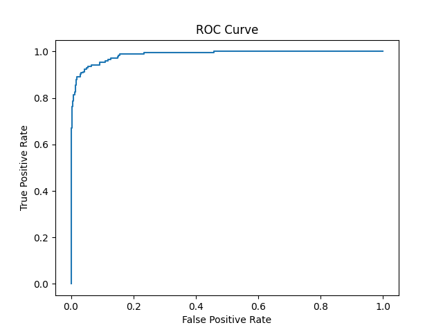

# 🕵️ Job Fraud Detection System

A Machine Learning project that detects **fraudulent job postings** using **Natural Language Processing (NLP)** and **Logistic Regression**.

This system analyzes job descriptions and predicts whether the job is **Real or Fraudulent**.

---

# 🚀 Project Overview

Online job platforms often contain fake job postings used for scams.
This project builds a **machine learning model** to automatically identify fraudulent job listings.

The model uses:

* **TF-IDF Vectorization**
* **Logistic Regression**
* **Text preprocessing**
* **Streamlit Web App**
* **FastAPI REST API**

---

# 🧠 Machine Learning Pipeline

1. Data Cleaning
2. Text Preprocessing
3. TF-IDF Feature Extraction
4. Logistic Regression Model
5. Model Evaluation using ROC Curve
6. Deployment using Streamlit and FastAPI

---

# 📁 Project Structure

```
job-fraud-detection
│
├── src
│   ├── train.py          # Model training
│   └── predict.py        # Prediction logic
│
├── models
│   └── fraud_pipeline.pkl
│
├── app.py                # Streamlit web app
├── api.py                # FastAPI REST API
├── requirements.txt      # Dependencies
├── ROC.png               # Model evaluation
└── README.md
```

---

# 📊 Model Performance

The model performance is evaluated using the **ROC Curve**.



---

# ⚙️ Installation

Clone the repository:

```
git clone https://github.com/Flash6699/job-fraud-detection.git
```

Move into the project folder:

```
cd job-fraud-detection
```

Create virtual environment:

```
python -m venv fraudenv
```

Activate environment:

Windows:

```
fraudenv\Scripts\activate
```

Install dependencies:

```
pip install -r requirements.txt
```

---

# 🖥 Run Streamlit App

```
streamlit run app.py
```

App will run at:

```
http://localhost:8501
```

---

# 🔌 Run FastAPI Server

```
uvicorn api:app --reload
```

API will run at:

```
http://127.0.0.1:8000
```

API documentation available at:

```
http://127.0.0.1:8000/docs
```

---

# 🧪 Example API Request

```
POST /predict
```

Example JSON:

```
{
  "text": "Earn $5000 weekly working from home with no experience required"
}
```

Response:

```
{
  "prediction": "Fraudulent Job"
}
```

---

# 🛠 Technologies Used

* Python
* Scikit-learn
* Pandas
* NumPy
* Streamlit
* FastAPI
* TF-IDF Vectorizer

---

# 👨‍💻 Author

**Vedant Shinde**

GitHub:
https://github.com/Flash6699

---

# ⭐ If you like this project

Please consider **starring the repository** ⭐
